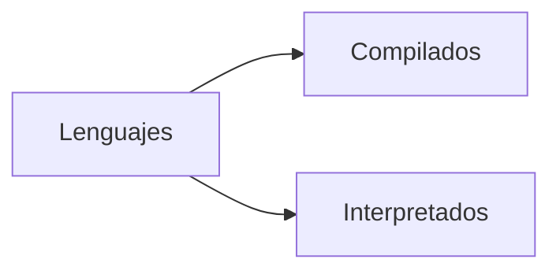
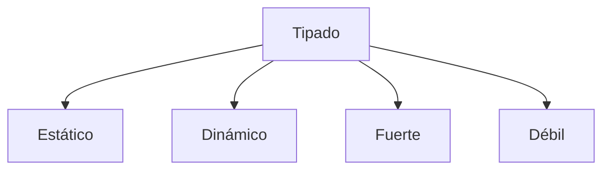

# Curso profesional de Python

<p style="text-align: right;">
    <strong>Con: Facundo García Martoni</strong>
</p>

[TOC]

## ¿Cómo funciona Python? 🤔

A los lenguajes de programación se les suele dividir en dos grandes familias: *compilados* e *interpretados*:



Los lenguajes *compilados* como C, C++, Fortran o Go, utilizan un compilador para ser transformados a código máquina (`0`s y `1`s). Pero Python es un lenguaje *interpretado*, al correr el programa, no se pasa a código máquina, sino a *byte code*. El *byte code* es de más bajo nivel que nuestro código y lo lee un intérprete (una máquina virtual) multiplataforma que luego lo traduce a lenguaje máquina.

> 💡 La carpeta `__pycache__` guarda el *byte code* del código para no tener que volver a traducirlo y ahorrarnos tiempo si no modificamos nuestro programa.

Otra de las funciones del intérprete es eliminar de forma automática las variables que ya no se usan (*garbage collector*) para ir liberando la memoria del sistema.


### Organización de archivos 📂

-  Todo archivo que termine en .py es un *módulo* de Python.
- Un *paquete* es una carpeta con una colección de módulos.

Los paquetes siempre poseen el archivo `__init__.py` (que se lee como  se lee como *dunder init*)

> 💡 "Dunder" viene del inglés ***D**ouble **under**score*.

A pesar de que cada proyecto es diferente y de que cada *framework* tiene su propuesta de trabajo, una estructura típica es:

```
Proyecto
	|- venv
	|- .gitignore
	|- README.md
	|- Paquete
		|- __init__.py
		|- module_1.py
		|- module_2.py
		|- tests.py
```

## Tipado 🌘

Esta es otra forma de categorizar a los lenguajes de programación. Hay cuatro categorías de tipado:



- Los lenguajes de **tipado estático** levantan un error al momento de compilar, como en Java:

  ```java
  String str = "Holi";
  str = 5; // ¡Error!   
  ```
  
- Con **tipado dinámico** no se levanta un error sino hasta el tiempo de ejecución (cuando ya está funcionando el programa y se llega a esa línea específica). Por ejemplo, en Python:

  ```python
  str = "Holi"
  str = 5 # Todo bien 👌
  ```

Los lenguajes se categorizan como **fuerte** o **débilmente** tipados dependiendo de la *severidad* con que se tratan los tipos de datos. En Python **no** podemos sumar `1 + "2"`, pero en JavaScript sí:

```javascript
const x = 1;
const y = "2";
let z = x + y // 12
```


> 💡 C y C++ están en un debate sobre su tipado. Algunos argumentan que es *débilmente tipado* ya que pueden ocurrir *type - castings* de forma silenciosa y dar lugar a errores que sean difíciles de localizar.

### Static Typing en Python

El tipado dinámico de Python puede ser peligroso porque puede causar errores que pasen desapercibidos. Un lenguaje de tipado estático (como Java) nos daría aviso **antes** de cualquier error, incluso **antes** de ejecutarse. Para poder emular esto en Python tenemos dos opciones:

- Usar una sintaxis `variable: tipo = valor` (a partir de la versión 3.6)
- Usar el módulo `mypy`

#### Sintaxis de tipado estático

```python
# --------------------------
# Static typing en variables
# --------------------------

a: int = 5
b: str = "Holi"
c: bool = True

# --------------------------
# Static typing en funciones
# --------------------------

# Función con argumentos de tipo entero que retorna un entero
def suma(a: int,b: int) -> int:
	return a + b

print(suma('1','2')) # '12' porque todavía está en trabajo

# -------------------------------------
# Static typing en estructuras de datos
# -------------------------------------

from typing import List, Dict

fav_numbers: List[int] = [4, 7, 14, 17, 24, 27, 40, 44, 57]
users: Dict[str, int] = {
    "Argentina": 1,
    "México": 34,
    "Colombia": 45
}

countries: List[Dict[str, str]] = [
    {
        "name": "México",
        "capital": "CDMX"
    },
    {
        "name": "Israel",
        "capital": "Jerusalén"
    }
]
```

Como las tuplas no pueden modificarse, es posible hacer el tipado de *cada* elemento que las conforma:

```python
from typing import Tuple

data: Tuple[int, float, str] = (3, 3.1416, "Pi")
```

> 💡 A partir de la versión 3.9 se puede hacer el tipado a una lista o diccionario de una variable con la sintaxis `variable: tipo = valor`

Y también se pueden crear *aliases* de tipos (similar a como se puede hacer en C):

```python
from typing import Tuple, List, Dict

CoordinatesType = List[Dict[str, Tuple[int, int]]]

coordinates: CoordinatesType = [
    {
        "coord1": (1,2)
        "coord2": (3,4)
    },
    {
        "coord1": (10,11)
        "coord2": (12,13)
    }
]
```

#### Usando `mypy`

Para checar los errores de tipado usamos el comando `mymy <file.py> --check-untyped-defs`. De esta forma tendremos, o bien un mensaje de que todo esta bien, o de que hubo algún error. Por ejemplo, si tenemos una función para checar palíndromos

```python
def check_if_palindrome(word: str) -> bool :
    word = word.replace(" ", "").lower()
    return word == word[::-1]


# Main function & entry point
def run():
    message = 1000
    print(check_if_palindrome(message))


if __name__ == '__main__':
    run()
```

Usando `mypy palindrome.py --check-untyped-defs` obtendríamos un mensaje de error:

```
palindrome.py:9: error: Argument 1 to "check_if_palindrome" has incompatible type "int"; expected "str"
Found 1 error in 1 file (checked 1 source file)
```

## Conceptos avanzados de funciones 🧭

### Alcance de variables

> 💡 Una variable sólo está disponible dentro de la región en la que fue creada.

El *local scope* se refiere a variables que son creadas **dentro** de alguna función y, por l o tanto, sólo son accesibles en esa función. Por otra parte, el *global scope* permite que la variable sea accedida desde **cualquier punto** del programa. Por ejemplo:

```python
# Global scope
x = "Global"

# Local scope
def my_fun():
    x = "Local"
    print(x)
    
my_fun() # "Local"
print(x) # "Global"
```

> 💡 Aunque tengan el mismo nombre, distintos *scopes* se asignan a distintas variables.

```python
z = 5

def my_func():
	z = 3

	def my_other_func():
		z = 2
		print(z)

	my_other_func() # 2

	print(z) # 3

my_func()	# 2 y luego 3
print(z)	# 5
```

### Closures

Un *closure* es una técnica en la cual se "recuerda" a una variable con un *scope* superior incluso si ese scope superior se elimina después (como con `del`). Requieren de:

1. Una *nested function* (una función dentro de otra función).
2. La nested function debe hacer referencia a una variable con scope superior.
2. La función que envuelve a la función anidada debe retornar a esta función.

Por ejemplo:

```python
def main():
	a = 1
	
	def nested():	# Regla 1
		print(a)	# Regla 2
	
	return nested	# Regla 3


my_func = main()
my_func() # 1
del(main)
my_func() # 1
```

> 💡 Los closures suelen ser temas de entrevistas de trabajo.

Un ejemplo más complejo donde *recordemos* variables de scope superior sería el siguiente (típico de entrevistas):

```python
def make_multiplier(x):
	
	def multiplier(n):
		return x * n
	
	return multiplier
	
times10 = make_multiplier(10)
times4 = make_multiplier(4)

print(times10(3))			# 30
print(times4(5))			# 20
print(times10(times4(2)))	# 80
```

Los closures suelen aparecer en dos escenarios principales:

- Al tener una clase corta que tenga sólo un método (por elegancia 💅)
- Al trabajar con (spoiler alert) [decoradores](#Decoradores 🎈).

### Decoradores 🎈

Un decorador es una función que recibe como parámetro otra función (función de orden superior), le añade cosas y retorna una función diferente.

> 💡 Un decorador es un closure especial.

```python
def decorador(func):
	def wrapper():
		print("Extra: esto no estaba en la función original 📰")
		func()
	return wrapper

def saludo():
	print("Hola!")   

saludo() # Hola!

saludo = decorador(saludo)
saludo() 
# Output:
# Extra: esto no estaba en la función original 📰
# Hola!
```

> 💡 Es común crear una función e inmediatamente después decorarla.

Al ser tan común este patrón, en Python podemos hacerlo de una forma más rápida, bella y estética:

```python
def decorador(func):
	def wrapper():
		print("Extra: esto no estaba en la función original 📰")
		func()
	return wrapper

@decorador
def saludo():
	print("Hola!")

saludo()
```

> 💡 La *azúcar sintáctica* (sugar syntax) se refiere a un código embellecido para nosotros verlo de forma más estética.

Para lograr que un decorador funcione con funciones que tengan o no parámetros sólo se debe anidar una función que reciba estos parámetros antes de la función que se quiere decorar. Por ejemplo:

```python
def with_custom_message(message):
    def with_message(function):
        print(f"{message}:")
        def wrapper(*args, **kwargs):
            function(*args, **kwargs)
        return wrapper
    return with_message


@with_custom_message("Hello!")
def int_multiply(a: int,b: int) -> int:
    c: int = a * b
    print(f"{a}×{b} = {c}")
```

> 💡 `*args` y `**kwargs` son una forma de recibir argumentos *posicionales* o nombrados, los haya o no

Un uso práctico muy útil de decoradores es poder evaluar el tiempo de ejecución de una función:

```python
from datetime import datetime

def execution_time(func):
    def wrapper():
        initial_time = datetime.now()
        func()
        final_time = datetime.now()
        time_elapsed = final_time - initial_time
        print(f"{time_elapsed.total_seconds()} seconds elapsed")
    return wrapper


@execution_time
def random_func():
    for _ in range(1_000_000):
        pass

random_func()
```

## Estructuras de datos avanzadas

### Iteradores 🔁

Un *iterable* es cualquier objeto que podemos recorrer con un ciclo (listas, cadenas de caracteres, etc.). Cuando se hace un ciclo, Python no recorre el iterable como tal, sino que el iterable se convierte a un objeto especial: un *iterador*.

Todo *iterable* se puede convertir en un *iterador* con la función `iter()` y, para recorrerlo se usa la función `next()`. Cuando se llega al último elemento y se usa `next()`, se eleva la excepción `StopIteration`:

```python
my_list = [4, 7, 17, 44, 57]
my_iter = iter(my_list)

# Barrido manual
print(next(my_iter)) # 4
print(next(my_iter)) # 7
print(next(my_iter)) # 17

# Barrido con ciclos
while True:
	try:
		element = next(big_iter)
		print(element)
	except StopIteration:
		break

# Barrido con syntax sugar
for element in my_list:
	print(element)
```

> 💡 El ciclo `for` **no existe** dentro de Python; sólo es un alias para el ciclo `while` de un iterador.

Para *construir* un iterador se debe armar una clase con dos métodos importandes:

1. El *dunder iter* (`__iter__`)
2. El *dunder next* (`__next__`)

```python
class EvenNumbers:
    """ Iterador de:
        (a) todos los números pares
        (b) todos los números pares hasta un máximo
    """

    def __init__(self, max = None) -> None:
        self.max = max

    def __iter__(self):
        self.num = 0
        return self
    
    def __next__(self):
        if not (self.max) or self.num <= self.max:
            result = self.num
            self.num += 2
            return result
        else:
            raise StopIteration
```

> 💡 El método `__init__` sólo es necesario si se desea iniciar algún atributo junto con la instancia de la clase.

La ventaja de usar iteradores incluye ahorrar recursos ya que son un símil de usar .svg vs. .jpg; es decir, almancenan *la fórmula de creación de elementos* en vez de *la lista de elementos* y, por lo mismo, son más rápidos.

### Generadores

Python entiende que usar iteradores es complejo: hay que hacer una clase con los métodos `__iter_` y `__next__`, usando atributos y el manejo de la excepción `StopIteration`, etc. Los *generadores* son, básicamente, *sugar syntax* de los iteradores.

Cuando se ejecuta un `return`, una *función* termina, pero cuando se ejecuta un `yield`, la función retorna un valor y, si se vuelve a invocar, comienza desde donde se quedó, es decir, desde el último `yield`:

```python
def my_generator():
	"""Ejemplo de un generador"""
	
	print("Hello, world!")
	n = 0
	yield n
	
	print("Hello, heaven!")
	n = 1
	yield n
	
	print("Hello, hell!")
	n = 2
	yield n

x = my_generator # Instanciamos la clase

print(next(x)) # Hello, world!
print(next(x)) # Hello, heaven!
print(next(x)) # Hello, hell!
print(next(x)) # StopIteration
```

> 💡 Los generadores son funciones que guardan un estado.

Así como hay *list* y *dict* comprehension, también hay *generator comprehension* simplemente usando `()`. La diferencia es que un *list comprehension* guarda **todos** los datos en memoria, mientras que un generador no, simplemente va *generando* cada dato conforme se necesite:

```python
my_list = [0,1,4,7,14,17,24,40,44,57]

square_list = [x**2 for x in my_list]
square_gen = (x**2 for x in my_list)
```

### Sets 🎾

Los *sets* o *conjuntos* son una coleción inmutable y desordenada de elementos únicos. Son muy utilizados con bases de datos. Para crearlos, se usan llaves (`{}`) pero sin usar doble punto (`:`) o se haría un diccionario:

```python
my_set1 = {3, 4, 5}
print("my_set1 = ", my_set1) # my_set1 = {3, 4, 5}

my_set2 = {"Holi", 23.3, False, True}
print("my_set2 = ", my_set2) # my_set2 = {False, True, 'Holi', 23.3}

my_set3 = {3, 3, 2}
print("my_set3 = ", my_set3) # my_set3 = {2, 3}

my_set4 = {[1, 2, 3], 4}
print("my_set4 = ", my_set4) # Error
```

> 💡 Python automáticamente elimina los elementos repetidos de un set.

Para manipular sets y sus datos:

- Podemos hacer type casting o crear uns et vacío con la función `set()`
- Podemos añadir elementos con los método `add()` o `update()`
- Podemos eliminar elementos con `discard()` o `remove()`
- Podemos eliminar un elemento aleatorio del set con `pop()`
- Podemos eliminar **todos** los elementos de un set con `clear()`

```python
# Casting de sets
my_list = [1, 1, 4, 8, 14]
my_set = set(my_list)
print("my_set = ", my_set) # my_set =  {8, 1, 4, 14}

# Creando un set vacío
empty_set = set()

# Añádiendo elementos al set vacío
empty_set.add(1)
print("empty_set = ", empty_set) # empty_set = {1}

empty_set.update([1, 2, 3, 4])
print("empty_set = ", empty_set) # empty_set = {1, 2, 3, 4}

empty_set.update([1, 5, 6], {7, 8})
print("empty_set = ", empty_set) # empty_set = {1, 2, 3, 4, 5, 6, 7, 8}

# Eliminando elementos del set "vacío"
empty_set.discard(7)
print("empty_set = ", empty_set) # empty_set =  {1, 2, 3, 4, 5, 6, 8}

empty_set.remove(8)
print("empty_set = ", empty_set) # empty_set =  {1, 2, 3, 4, 5, 6}

empty_set.discard(7) # Elemento inexistente
print("empty_set = ", empty_set) # empty_set =  {1, 2, 3, 4, 5, 6}

empty_set.remove(8) # Elemento inexistente
print("empty_set = ", empty_set) # Error KeyError

```

> 💡 `discard()` permite "eliminar" un elemento inexistente, pero `remove()` elevará un error.

#### Unión ($A \cup B$) 

```python
# Por operador
union = set1 | set2

#Por método
union = set1.union(set2)
```


#### Intersección ($A \cap B$)

```python
# Por operador
intersection = set1 & set2

#Por método
intersection = set1.intersection(set2)
```


#### Diferencia ($A - B$)

```python
# Por operador
difference = set1 - set2

#Por método
difference = set1.difference(set2)
```


#### Diferencia simétrica ($A \Delta B$)

```python
# Por operador
symmetric_difference = set1 ^ set2

#Por método
symmetric_difference = set1.symmetric_difference(set2)
```


## Manejo de fechas 📆

Hay muchos eventos para los cuales querríamos manejar fechas (cuando se crea un usuario, cuando se sube una foto, cuando se hace una experimento 👀) y, para eso, usamos el módulo `datetime`. Este módulo tiene la clase `datetime` con el método `now()` que puede

- Devolver la fecha y hora de la computadora (si esta configurada) o
- Devolver la fecha UTC si no (como en un servidor, por ejemplo)

```python
import datetime as dt

# Manejo de fechas con hora

# Manejo de sólo la fecha
today = dt.date.today()
year = today.year
month = today.month
day = today.day
```

> 💡 Es mejor usar `utcnow()` para usar la hora universal en equipos de trabajo internacionales.

### Formato de fecha

En EE. UU. el formato de fecha es mm/dd/yyyy (🙄), mientras que en latinoamérica es dd/mm/yyyy (😌). En Python podemos especificar cómo mostrar la fecha con el método `strftime()` mediante *placeholders*; [hay más en la documentación](https://docs.python.org/es/3/library/datetime.html#strftime-and-strptime-format-codes), pero estos son los más comunes:

| Placeholder | Elemento |
| :---------: | :------: |
|    `%Y`     |   Año    |
|    `%m`     |   Mes    |
|    `%d`     |   Día    |
|    `%H`     |   Hora   |
|    `%M`     |  Minuto  |
|    `%S`     | Segundo  |

### Zonas horarias

Para el manejo de zonas horarias existe el módulo `pytz` que usa la lista de zonas horarias:

```python
from datetime import datetime
import pytz

bogota_tz = pytz.timezone("America/Bogota")
bogota_time = datetime.now(bogota_tz)

mexico_tz = pytz.timezone("America/Mexico_City")
mexico_time = datetime.now(mexico_tz)

caracas_tz = pytz.timezone("America/Caracas")
caracas_time = datetime.now(caracas_tz)

print("CDMX: ", mexico_time.strftime("%d/%m/%Y %H:%M"))
print("Bogotá: ", bogota_time.strftime("%d/%m/%Y %H:%M"))
print("Caracas: ", caracas_time.strftime("%d/%m/%Y %H:%M"))
```

> 💡 El módulo `pytz` no viene con python y debe instalarse con pip.