# Curso profesional de Python

[TOC]

## ¿Cómo funciona Python? 🤔 

A los lenguajes de programación se les suele dividir en dos grandes familias: *compilados* e *interpretados*:


Los lenguajes *compilados* como C, C++, Fortran o Go, utilizan un compilador para ser transformados a código máquina (`0`s y `1`s). Pero Python es un lenguaje *interpretado*, al correr el programa, no se pasa a código máquina, sino a *byte code*. El *byte code* es de más bajo nivel que nuestro código y lo lee un intérprete (una máquina virtual) multiplataforma que luego lo traduce a lenguaje máquina.

> 💡 La carpeta `__pycache__` guarda el *byte code* del código para no tener que volver a traducirlo y ahorrarnos tiempo si no modificamos nuestro programa.

Otra de las funciones del intérprete es eliminar de forma automática las variables que ya no se usan (*garbage collector*) para ir liberando la memoria del sistema.


### Organización de archivos 📂 

-  Todo archivo que termine en .py es un *módulo* de Python.
- Un *paquete* es una carpeta con una colección de módulos.

Los paquetes siempre poseen el archivo `__init__.py` (que se lee como  se lee como *dunder init*)

> 💡 "Dunder" viene del inglés ***D**ouble **under**score*.

A pesar de que cada proyecto es diferente y de que cada *framework* tiene su propuesta de trabajo, una estructura típica es:

```
Proyecto
	|- venv
	|- .gitignore
	|- README.md
	|- Paquete
		|- __init__.py
		|- module_1.py
		|- module_2.py
		|- tests.py
```

## Tipado 🌘 

Esta es otra forma de categorizar a los lenguajes de programación. Hay cuatro categorías de tipado:

```mermaid
flowchart TB
Tipado --> Estático & Dinámico & Fuerte & Débil
```



- Los lenguajes de **tipado estático** levantan un error al momento de compilar, como en Java:

  ```java
  String str = "Holi";
  str = 5; // ¡Error!   
  ```
  
- Con **tipado dinámico** no se levanta un error sino hasta el tiempo de ejecución (cuando ya está funcionando el programa y se llega a esa línea específica). Por ejemplo, en Python:

  ```python
  str = "Holi"
  str = 5 # Todo bien 👌 
  ```

Los lenguajes se categorizan como **fuerte** o **débilmente** tipados dependiendo de la *severidad* con que se tratan los tipos de datos. En Python **no** podemos sumar `1 + "2"`, pero en JavaScript sí:

```javascript
const x = 1;
const y = "2";
let z = x + y // 12
```


> 💡 C y C++ están en un debate sobre su tipado. Algunos argumentan que es *débilmente tipado* ya que pueden ocurrir *type - castings* de forma silenciosa y dar lugar a errores que sean difíciles de localizar.

### Static Typing en Python

El tipado dinámico de Python puede ser peligroso porque puede causar errores que pasen desapercibidos. Un lenguaje de tipado estático (como Java) nos daría aviso **antes** de cualquier error, incluso **antes** de ejecutarse. Para poder emular esto en Python tenemos dos opciones:

- Usar una sintaxis `variable: tipo = valor` (a partir de la versión 3.6)
- Usar el módulo `mypy`

#### Sintaxis de tipado estático

```python
# --------------------------
# Static typing en variables
# --------------------------

a: int = 5
b: str = "Holi"
c: bool = True

# --------------------------
# Static typing en funciones
# --------------------------

# Función con argumentos de tipo entero que retorna un entero
def suma(a: int,b: int) -> int:
	return a + b

print(suma('1','2')) # '12' porque todavía está en trabajo

# -------------------------------------
# Static typing en estructuras de datos
# -------------------------------------

from typing import List, Dict

fav_numbers: List[int] = [4, 7, 14, 17, 24, 27, 40, 44, 57]
users: Dict[str, int] = {
    "Argentina": 1,
    "México": 34,
    "Colombia": 45
}

countries: List[Dict[str, str]] = [
    {
        "name": "México",
        "capital": "CDMX"
    },
    {
        "name": "Israel",
        "capital": "Jerusalén"
    }
]
```

Como las tuplas no pueden modificarse, es posible hacer el tipado de *cada* elemento que las conforma:

```python
from typing import Tuple

data: Tuple[int, float, str] = (3, 3.1416, "Pi")
```

> 💡 A partir de la versión 3.9 se puede hacer el tipado a una lista o diccionario de una variable con la sintaxis `variable: tipo = valor`

Y también se pueden crear *aliases* de tipos (similar a como se puede hacer en C):

```python
from typing import Tuple, List, Dict

CoordinatesType = List[Dict[str, Tuple[int, int]]]

coordinates: CoordinatesType = [
    {
        "coord1": (1,2)
        "coord2": (3,4)
    },
    {
        "coord1": (10,11)
        "coord2": (12,13)
    }
]
```

#### Usando `mypy`

Para checar los errores de tipado usamos el comando `mymy <file.py> --check-untyped-defs`. De esta forma tendremos, o bien un mensaje de que todo esta bien, o de que hubo algún error. Por ejemplo, si tenemos una función para checar palíndromos

```python
def check_if_palindrome(word: str) -> bool :
    word = word.replace(" ", "").lower()
    return word == word[::-1]


# Main function & entry point
def run():
    message = 1000
    print(check_if_palindrome(message))


if __name__ == '__main__':
    run()
```

Usando `mypy palindrome.py --check-untyped-defs` obtendríamos un mensaje de error:

```
palindrome.py:9: error: Argument 1 to "check_if_palindrome" has incompatible type "int"; expected "str"
Found 1 error in 1 file (checked 1 source file)
```

## Conceptos avanzados de funciones 🧭

### Alcance de variables

> 💡 Una variable sólo está disponible dentro de la región en la que fue creada.

El *local scope* se refiere a variables que son creadas **dentro** de alguna función y, por l o tanto, sólo son accesibles en esa función. Por otra parte, el *global scope* permite que la variable sea accedida desde **cualquier punto** del programa. Por ejemplo:

```python
# Global scope
x = "Global"

# Local scope
def my_fun():
    x = "Local"
    print(x)
    
my_fun() # "Local"
print(x) # "Global"
```

> 💡 Aunque tengan el mismo nombre, distintos *scopes* se asignan a distintas variables.

```python
z = 5

def my_func():
	z = 3

	def my_other_func():
		z = 2
		print(z)

	my_other_func() # 2

	print(z) # 3

my_func()	# 2 y luego 3
print(z)	# 5
```

### Closures

Un *closure* es una técnica en la cual se "recuerda" a una variable con un *scope* superior incluso si ese scope superior se elimina después (como con `del`). Requieren de:

1. Una *nested function* (una función dentro de otra función).
2. La nested function debe hacer referencia a una variable con scope superior.
2. La función que envuelve a la función anidada debe retornar a esta función.

Por ejemplo:

```python
def main():
	a = 1
	
	def nested():	# Regla 1
		print(a)	# Regla 2
	
	return nested	# Regla 3


my_func = main()
my_func() # 1
del(main)
my_func() # 1
```

> 💡 Los closures suelen ser temas de entrevistas de trabajo.

Un ejemplo más complejo donde *recordemos* variables de scope superior sería el siguiente (típico de entrevistas):

```python
def make_multiplier(x):
	
	def multiplier(n):
		return x * n
	
	return multiplier
	
times10 = make_multiplier(10)
times4 = make_multiplier(4)

print(times10(3))			# 30
print(times4(5))			# 20
print(times10(times4(2)))	# 80
```

Los closures suelen aparecer en dos escenarios principales:

- Al tener una clase corta que tenga sólo un método (por elegancia 💅)
- Al trabajar con (spoiler alert) [decoradores](#Decoradores 🎈).

### Decoradores 🎈 

Un decorador es una función que recibe como parámetro otra función (función de orden superior), le añade cosas y retorna una función diferente.

> 💡 Un decorador es un closure especial.

```python
def decorador(func):
	def wrapper():
		print("Extra: esto no estaba en la función original 📰")
		func()
	return wrapper

def saludo():
	print("Hola!")   

saludo() # Hola!

saludo = decorador(saludo)
saludo() 
# Output:
# Extra: esto no estaba en la función original 📰 
# Hola!
```

> 💡 Es común crear una función e inmediatamente después decorarla.

Al ser tan común este patrón, en Python podemos hacerlo de una forma más rápida, bella y estética:

```python
def decorador(func):
	def wrapper():
		print("Extra: esto no estaba en la función original 📰")
		func()
	return wrapper

@decorador
def saludo():
	print("Hola!")

saludo()
```

> 💡 La *azúcar sintáctica* (sugar syntax) se refiere a un código embellecido para nosotros verlo de forma más estética.

Para lograr que un decorador funcione con funciones que tengan o no parámetros sólo se debe anidar una función que reciba estos parámetros antes de la función que se quiere decorar. Por ejemplo:

```python
def with_custom_message(message):
    def with_message(function):
        print(f"{message}:")
        def wrapper(*args, **kwargs):
            function(*args, **kwargs)
        return wrapper
    return with_message


@with_custom_message("Hello!")
def int_multiply(a: int,b: int) -> int:
    c: int = a * b
    print(f"{a}×{b} = {c}")
```

> 💡 `*args` y `**kwargs` son una forma de recibir argumentos *posicionales* o nombrados, los haya o no

Un uso práctico muy útil de decoradores es poder evaluar el tiempo de ejecución de una función:

```python
from datetime import datetime

def execution_time(func):
    def wrapper():
        initial_time = datetime.now()
        func()
        final_time = datetime.now()
        time_elapsed = final_time - initial_time
        print(f"{time_elapsed.total_seconds()} seconds elapsed")
    return wrapper


@execution_time
def random_func():
    for _ in range(1_000_000):
        pass

random_func()
```
